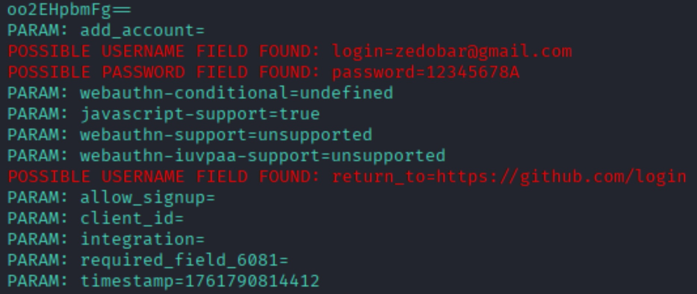

# Phishing para captura de senhas do Github

 - Esses comandos, servem para pegar dados de login e senha.

### Ferramentas
- Kali Linux
- setoolkit

### Configuração
- Acesso root: sudo su
- Iniciando o setoolkit: sudo setoolkit
- Tipo de ataque: Social-Engineering Attacks
- Vetor de ataque: Web Site Attack Vectors
- Método de ataque: Credential Harvester Attack Method 
- Método de ataque: Site Cloner
- Obtendo o endereço da máquina: ifconfig
- URL para clone: http://www.github.com/login

### Captura do resultado:

